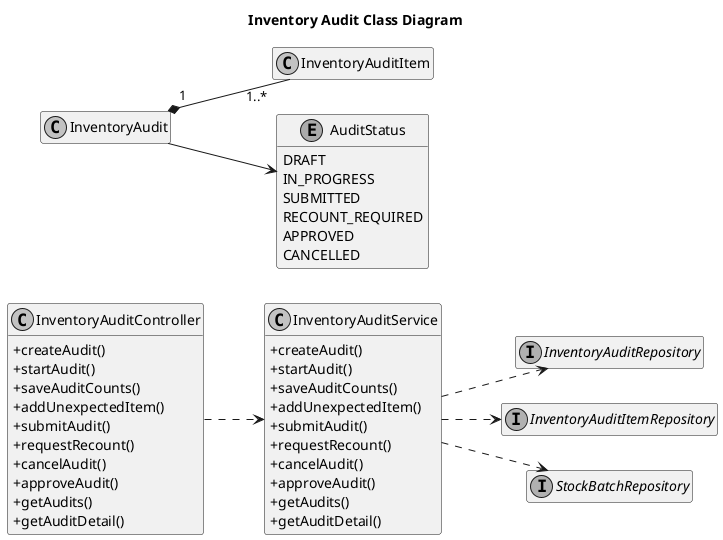
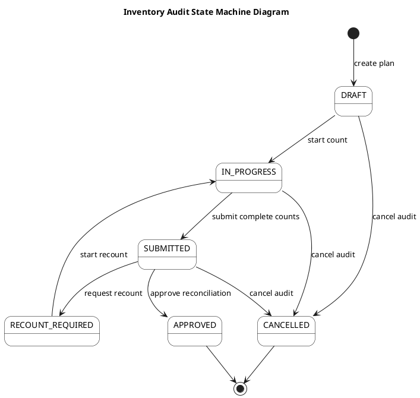

# Inventory Audit UML Sources

These diagrams describe the single canonical audit workflow. The historical
snapshot/submit/reject flow is no longer exposed or writable.

## Inventory Audit Class Diagram

## Count and Reconcile Inventory Audit Sequence Diagram

## Inventory Audit State Machine Diagram

The states are the actual canonical `AuditStatus` enum. Approval is the
stock-adjustment boundary; the state diagram does not imply a separate task or
ticket entity.
