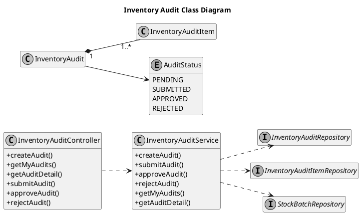
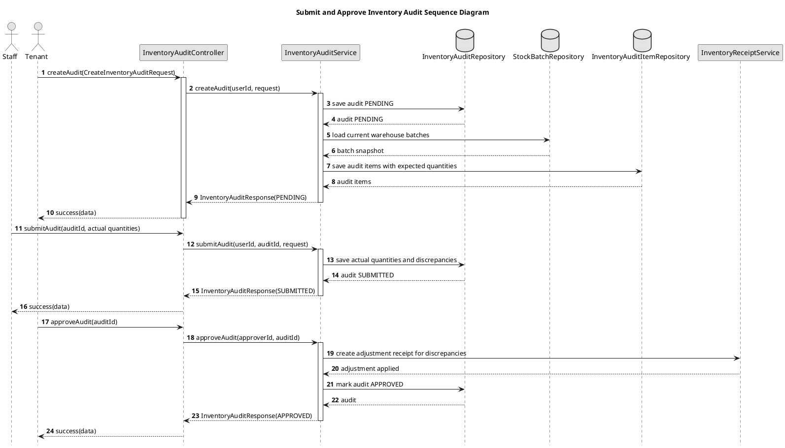
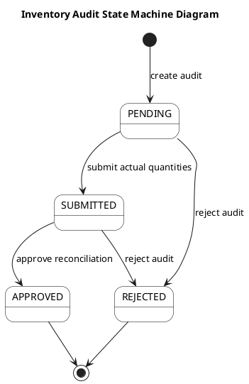

# Inventory Audit UML Sources

## Inventory Audit Class Diagram

## Submit and Approve Inventory Audit Sequence Diagram

## Inventory Audit State Machine Diagram

The states are the actual `AuditStatus` enum. Approval is the stock-adjustment
boundary; the state diagram does not imply a separate task or ticket entity.
