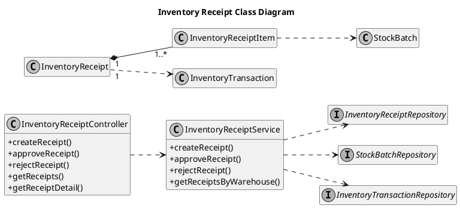
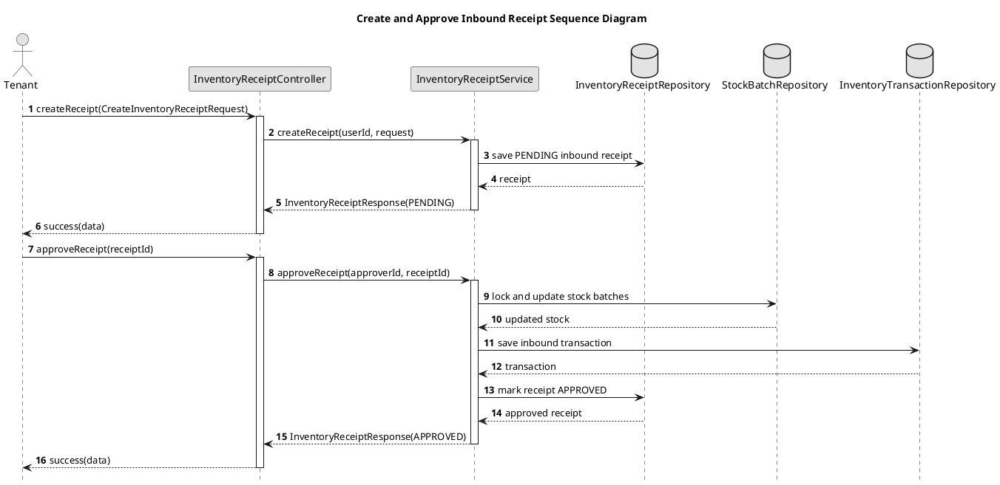

# Inventory Receipt UML Sources

## Inventory Receipt Class Diagram

## Create and Approve Inbound Receipt Sequence Diagram

The backend re-checks stock and capacity during approval. A client must not
assume that a previous layout or put-away preview is still valid.
