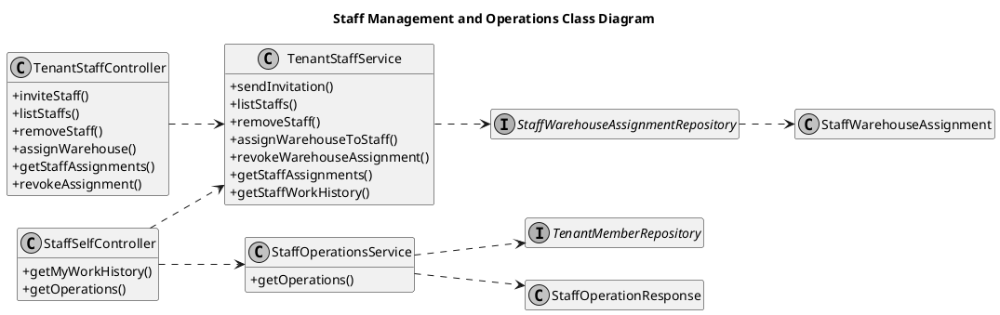
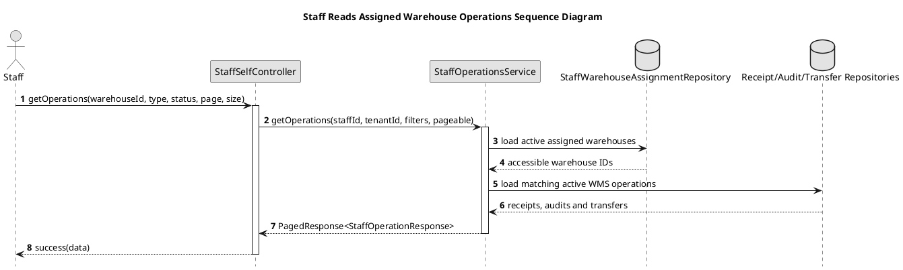

# Staff Operations UML Sources

## Staff Management and Operations Class Diagram

## Staff Reads Assigned Operations Sequence Diagram

This is a read-only projection. Staff actions continue through the owning
Receipt, Audit and Transfer APIs, and the backend re-checks the active
assignment and contract for every request.
