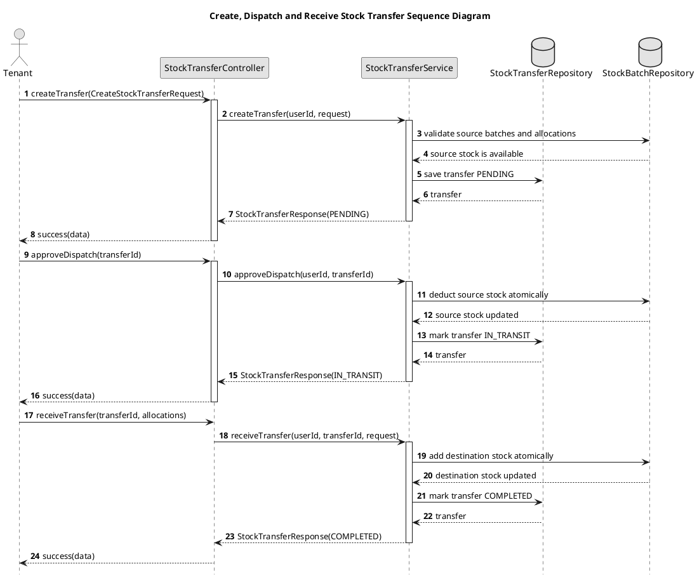
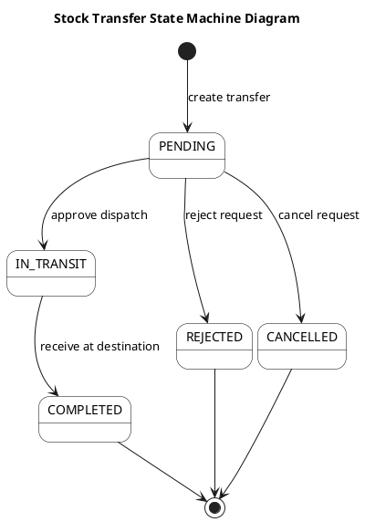

# Stock Transfer UML Sources

## Stock Transfer Class Diagram

```plantuml
@startuml
title Stock Transfer Class Diagram
skinparam monochrome true
skinparam shadowing false
skinparam backgroundColor transparent
skinparam classAttributeIconSize 0
hide empty members
left to right direction

class StockTransferController {
  +createTransfer(request: CreateStockTransferRequest): ApiResponse<StockTransferResponse>
  +getTransfers(sourceWarehouseId: UUID, destinationWarehouseId: UUID, status: StockTransferStatus, page: int, size: int): PagedResponse<StockTransferResponse>
  +getTransfer(id: UUID): ApiResponse<StockTransferResponse>
  +approveDispatch(id: UUID): ApiResponse<StockTransferResponse>
  +receiveTransfer(id: UUID, request: ReceiveStockTransferRequest): ApiResponse<StockTransferResponse>
  +rejectTransfer(id: UUID, request: StockTransferDecisionRequest): ApiResponse<StockTransferResponse>
  +cancelTransfer(id: UUID, request: StockTransferDecisionRequest): ApiResponse<StockTransferResponse>
}

class StockTransferService {
  +createTransfer(userId: UUID, request: CreateStockTransferRequest): StockTransferResponse
  +getTransfers(userId: UUID, sourceWarehouseId: UUID, destinationWarehouseId: UUID, status: StockTransferStatus, pageable: Pageable): PagedResponse<StockTransferResponse>
  +getTransfer(userId: UUID, transferId: UUID): StockTransferResponse
  +approveDispatch(userId: UUID, transferId: UUID): StockTransferResponse
  +receiveTransfer(userId: UUID, transferId: UUID, request: ReceiveStockTransferRequest): StockTransferResponse
  +rejectTransfer(userId: UUID, transferId: UUID, request: StockTransferDecisionRequest): StockTransferResponse
  +cancelTransfer(userId: UUID, transferId: UUID, request: StockTransferDecisionRequest): StockTransferResponse
}

interface StockTransferRepository
class StockTransfer
class StockTransferItem
class StockTransferSourceAllocation
class StockTransferDestinationAllocation
enum StockTransferStatus {
  PENDING
  IN_TRANSIT
  COMPLETED
  REJECTED
  CANCELLED
}

StockTransferController ..> StockTransferService
StockTransferService ..> StockTransferRepository
StockTransfer "1" *-- "1..*" StockTransferItem
StockTransferItem "1" *-- "0..*" StockTransferSourceAllocation
StockTransferItem "1" *-- "0..*" StockTransferDestinationAllocation
StockTransfer --> StockTransferStatus
@enduml
```

## Create, Dispatch and Receive Transfer Sequence Diagram

## Stock Transfer State Machine Diagram

The diagram intentionally has no `APPROVED` state. Dispatch changes the state
to `IN_TRANSIT` after source stock is deducted; receiving adds stock at the
destination using destination-specific allocations.
