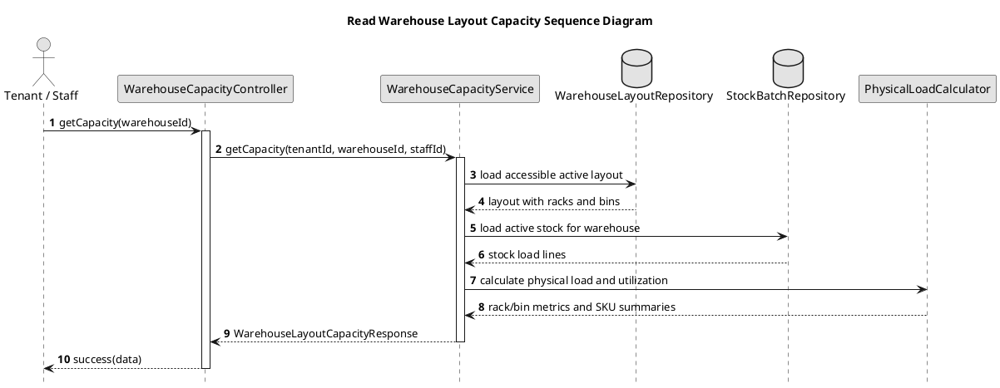

# Warehouse Layout and Capacity UML Sources

These PlantUML sources are the compact Review 3 version. They show only the
classes and messages affected by Plans 02–03. All dimensions are real meters;
capacity values are read-only metrics from the current stock and layout.

## Warehouse Layout and Capacity Class Diagram

```plantuml
@startuml
title Warehouse Layout and Capacity Class Diagram
skinparam monochrome true
skinparam shadowing false
skinparam backgroundColor transparent
skinparam classAttributeIconSize 0
hide empty members
left to right direction

class TenantLayoutController {
  +getLayout(warehouseId: UUID): ApiResponse<WarehouseLayoutResponse>
  +saveLayout(warehouseId: UUID, request: BulkLayoutSaveRequest): ApiResponse<WarehouseLayoutResponse>
}

class StaffWarehouseLayoutController {
  +getLayout(warehouseId: UUID): ApiResponse<WarehouseLayoutResponse>
}

class WarehouseCapacityController {
  +getCapacity(warehouseId: UUID): ApiResponse<WarehouseLayoutCapacityResponse>
}

class WarehouseLayoutService {
  +getLayoutTree(warehouseId: UUID, userId: UUID, role: String): WarehouseLayoutResponse
  +getStaffLayoutTree(warehouseId: UUID, staffId: UUID, tenantId: UUID): WarehouseLayoutResponse
  +saveLayoutBulk(warehouseId: UUID, userId: UUID, role: String, request: BulkLayoutSaveRequest): WarehouseLayoutResponse
}

class WarehouseCapacityService {
  +getCapacity(tenantId: UUID, warehouseId: UUID, staffId: UUID): WarehouseLayoutCapacityResponse
}

class PhysicalLoadCalculator {
  +calculate(lines: Collection<PhysicalLoadLine>, maxWeight: BigDecimal, maxVolume: BigDecimal): PhysicalLoad
  +summarizeBySku(lines: Collection<PhysicalLoadLine>): List<SkuPhysicalLoad>
  +assertWithinCapacity(type: String, name: String, load: PhysicalLoad): void
}

interface WarehouseLayoutRepository
interface WarehouseRackRepository
interface WarehouseBinRepository
interface StockBatchRepository

class WarehouseLayout
class WarehouseRack
class WarehouseBin

TenantLayoutController ..> WarehouseLayoutService
StaffWarehouseLayoutController ..> WarehouseLayoutService
WarehouseCapacityController ..> WarehouseCapacityService
WarehouseLayoutService ..> WarehouseLayoutRepository
WarehouseLayoutService ..> WarehouseRackRepository
WarehouseLayoutService ..> WarehouseBinRepository
WarehouseCapacityService ..> WarehouseLayoutRepository
WarehouseCapacityService ..> StockBatchRepository
WarehouseCapacityService ..> PhysicalLoadCalculator
WarehouseLayout "1" *-- "0..*" WarehouseRack
WarehouseRack "1" *-- "0..*" WarehouseBin
@enduml
```

## Read Capacity Sequence Diagram

The capacity response is a read model. It does not reserve space or mutate
stock. Authorization and warehouse/contract/assignment checks remain in the
backend service layer.
